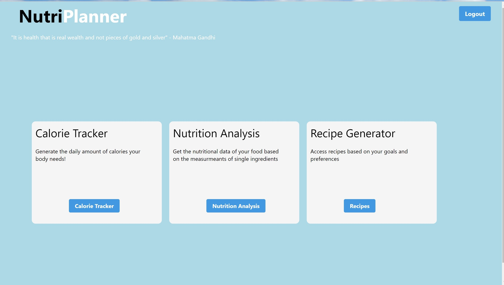
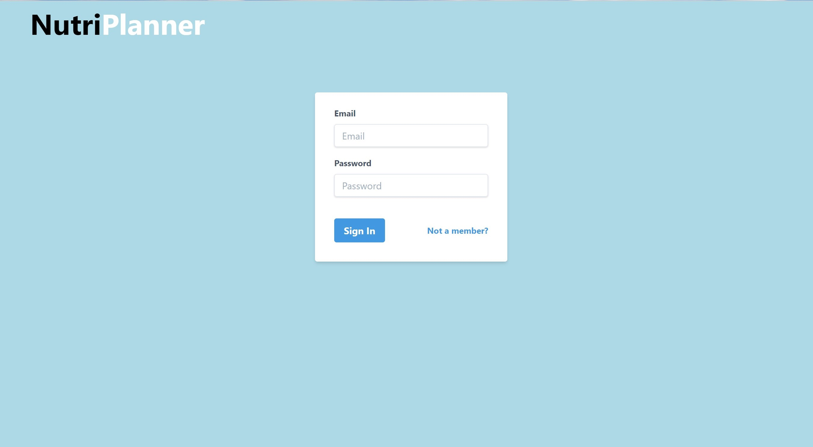
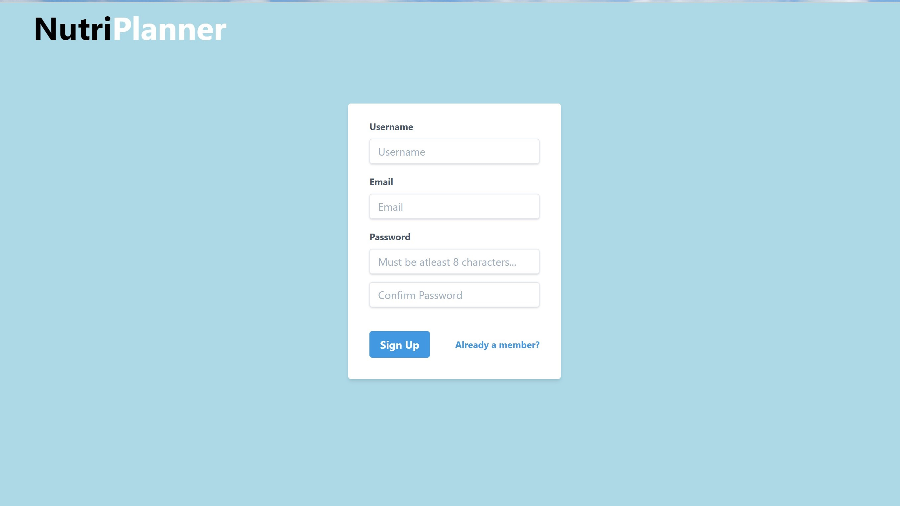
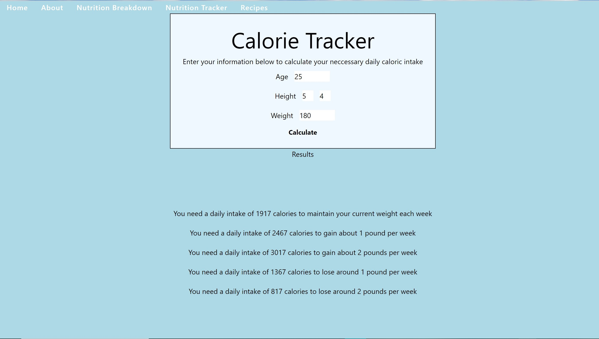
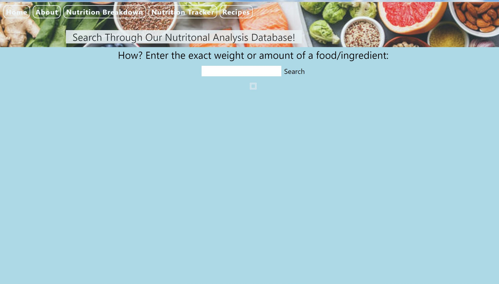
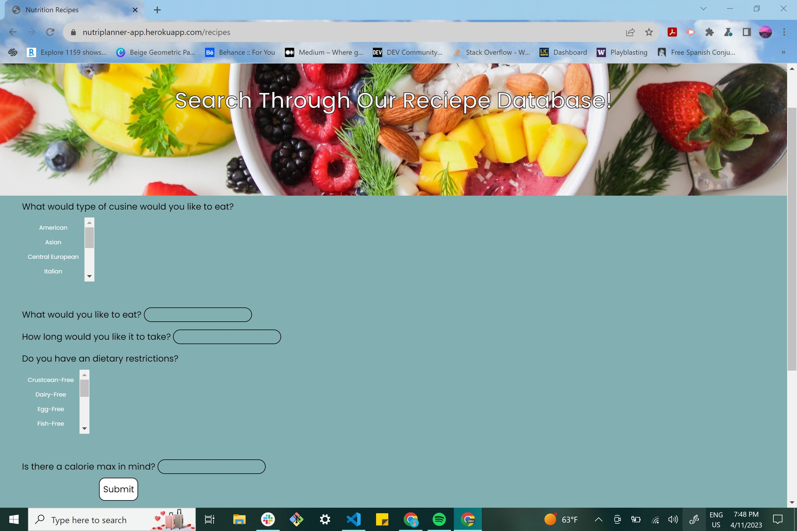

# Project #2: Fitness App  • 

## Description
NutriPlanner: Your Ultimate Fitness Nutrition Planner

NutriPlanner is a comprehensive fitness web app that empowers users to optimize their nutrition and meal planning with ease. With features like personalized calorie calculation, accurate nutrition data for ingredients, and customizable recipe generation based on dietary preferences and caloric goals, NutriPlanner is the ultimate tool for health-conscious individuals and fitness enthusiasts.

Key Features:

Personalized Calorie Calculation: Users can input their activity level and receive personalized calorie targets, ensuring they fuel their bodies with the right amount of energy for optimal performance.

Accurate Nutrition Data: NutriPlanner provides up-to-date nutrition information for ingredients, allowing users to make informed choices about their diet and meal planning.

Customizable Recipe Generation: Users can customize recipe recommendations based on dietary preferences, such as vegetarian, vegan, gluten-free, or dairy-free, and set specific caloric targets to align with their individual goals.

Intuitive and User-Friendly Interface: NutriPlanner offers an intuitive and easy-to-use interface, making it simple for users to navigate and plan their meals with precision.

Time-Saving and Convenient: NutriPlanner saves users time by eliminating the need for manual calculations and research, providing convenient access to accurate nutrition data and recipe recommendations in one place.

Whether you're a fitness enthusiast, health-conscious individual, or just looking to optimize your nutrition and meal planning, NutriPlanner is your go-to web app for achieving your fitness and health goals with confidence. Say goodbye to guesswork and hello to smarter, more effective nutrition planning with NutriPlanner.

## User Story
As a health-conscious individual who enjoys staying active and maintaining a balanced diet, 

I want to be able to easily calculate my daily caloric needs based on my activity level and receive personalized nutrition information on the ingredients I use in my meals.

I also want the option to generate recipes that align with my dietary preferences and caloric goals to make meal planning convenient and enjoyable. 

With the fitness web app, NutriPlanner, I can input my activity level, view accurate nutrition data on ingredients, and customize recipe recommendations based on my diet preferences and caloric targets. 

This allows me to confidently plan and prepare nutritious meals that support my fitness goals while optimizing my overall health and well-being.

NutriPlanner empowers me to make informed choices about my nutrition, saves me time in researching and planning meals, and enhances my ability to maintain a healthy lifestyle with ease.

## Screenshot

## Deployed Application Links

## Credits
### GitHub Collaborators:
Leslie Sanchez - https://github.com/lexslie

Paloma Baker - https://github.com/PalomaBaker

Kyle Engelbert - https://github.com/KyleBootCamp

Maryam Selassie - https://github.com/MariCods

Brian Lascuna - https://github.com/Brian-Lascuna

Ronan Sanchez -  https://github.com/Ronasian

## License
This project is licensed under The MIT License - see the LICENSE file for details
